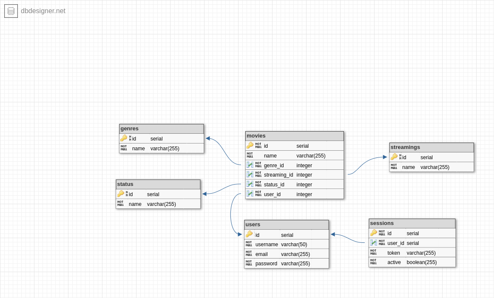

# Movies Wishlist

Esta aplicação é uma organizadora de filmes que o usuário deseja assistir.
Ao fazer login e adicionar um filme na lista de desejos, deverá informar o nome, o gênero e
a plataforma onde ele está disponível. Ao assistir o filme que está na lista, é
possível alterar seu status para "assistido" e caso opte é possível
excluir o filme da lista também.

## ⚙️ Funcionalidades

- Cadastrar-se na plataforma;
- Conectar-se na plataforma;
- Listar todos os filmes do usuário;
- Adicionar um filme na lista;
- Editar o status do filme;
- Deletar um filme da lista;
- Filtrar a quantidade de filmes por gênero;

## 📄 Documentação da API

#### INSCRIÇÃO:

```http
  POST /sign-up
```

- Body:

| Parâmetro  | Tipo     | Descrição             |
| :--------- | :------- | :-------------------- |
| `username` | `string` | `Username do usuário` |
| `email`    | `string` | `E-mail do usuário`   |
| `password` | `string` | `Senha do usuário`    |

--

#### LOGIN:

```http
  POST /sign-in
```

- Body:

| Parâmetro  | Tipo     | Descrição           |
| :--------- | :------- | :------------------ |
| `email`    | `string` | `E-mail cadastrado` |
| `password` | `string` | `Senha cadastrada`  |

--

#### RETORNA TODOS OS FILMES DA LISTA:

```http
  GET /wishlist
```

- Headers:

| Parâmetro       | Tipo     | Descrição           |
| :-------------- | :------- | :------------------ |
| `Authorization` | `string` | `'Bearer ${token}'` |

--

#### ADICIONA UM FILME NA LISTA:

```http
  POST /wishlist
```

- Body:

| Parâmetro      | Tipo     | Descrição                     |
| :------------- | :------- | :---------------------------- |
| `name`         | `string` | `Nome do filme`               |
| `genre_id`     | `number` | `o ID do gênero do filme`     |
| `streaming_id` | `number` | `o ID da plataforma do filme` |
| `status_id`    | `number` | `o ID do status do filme`     |

- Headers:

| Parâmetro       | Tipo     | Descrição           |
| :-------------- | :------- | :------------------ |
| `Authorization` | `string` | `'Bearer ${token}'` |

--

#### EDITA O STATUS DE UM FILME PARA ASSISTIDO:

```http
  PUT /movie/:id
```

- Params:

| Parâmetro | Tipo     | Descrição                            |
| :-------- | :------- | :----------------------------------- |
| `id`      | `string` | `o ID do filme que já foi assistido` |

- Headers:

| Parâmetro       | Tipo     | Descrição           |
| :-------------- | :------- | :------------------ |
| `Authorization` | `string` | `'Bearer ${token}'` |

--

#### DELETA UM FILME DA LISTA:

```http
  DELETE /movie/:id
```

- Params:

| Parâmetro | Tipo     | Descrição                          |
| :-------- | :------- | :--------------------------------- |
| `id`      | `string` | `o ID do filme que deseja deletar` |

- Headers:

| Parâmetro       | Tipo     | Descrição           |
| :-------------- | :------- | :------------------ |
| `Authorization` | `string` | `'Bearer ${token}'` |

--

#### MOSTRA A QUANTIDADE DE FILMES POR GÊNERO:

```http
  DELETE /movie/genre/:id
```

- Params:

| Parâmetro | Tipo     | Descrição                           |
| :-------- | :------- | :---------------------------------- |
| `id`      | `string` | `o ID do gênero que deseja filtrar` |

- Headers:

| Parâmetro       | Tipo     | Descrição           |
| :-------------- | :------- | :------------------ |
| `Authorization` | `string` | `'Bearer ${token}'` |

## 🎲 Database



## ▶️ Rodando a aplicação

- Crie uma pasta de projeto chamada 'movieswishlist':

```bash
  mkdir movieswishlist
```

- Clone este repositório na pasta criada;
- Instale suas depêndencias:

```bash
   npm i
```

- Crie um .env com base no .env.example;
- Crie um banco de dados local postgres utilizando o arquivo dump.sql;
- Inicie a aplicação na raíz do projeto:

```bash
   npm run dev
```

## 🛠️ Tecnologias

- NodeJS
- Express
- TypeScript
- Postgresql

## 🙇🏻‍♀️ Autora

- Feito com ❤️ por [@brunnaserafina](https://www.github.com/brunnaserafina)
